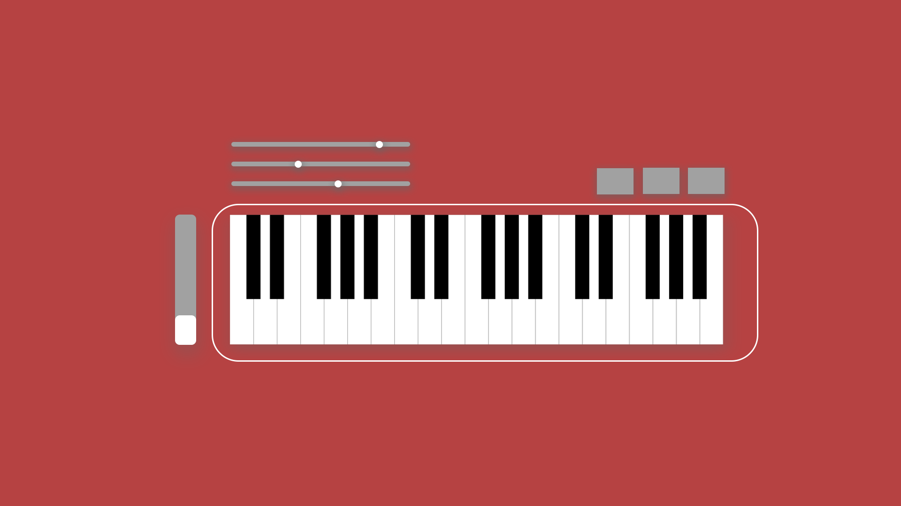
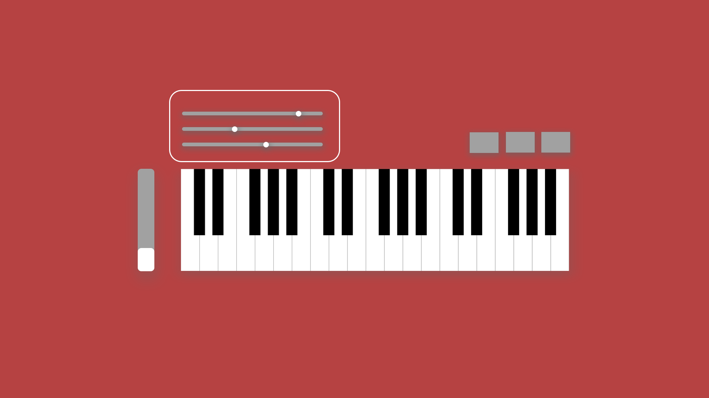
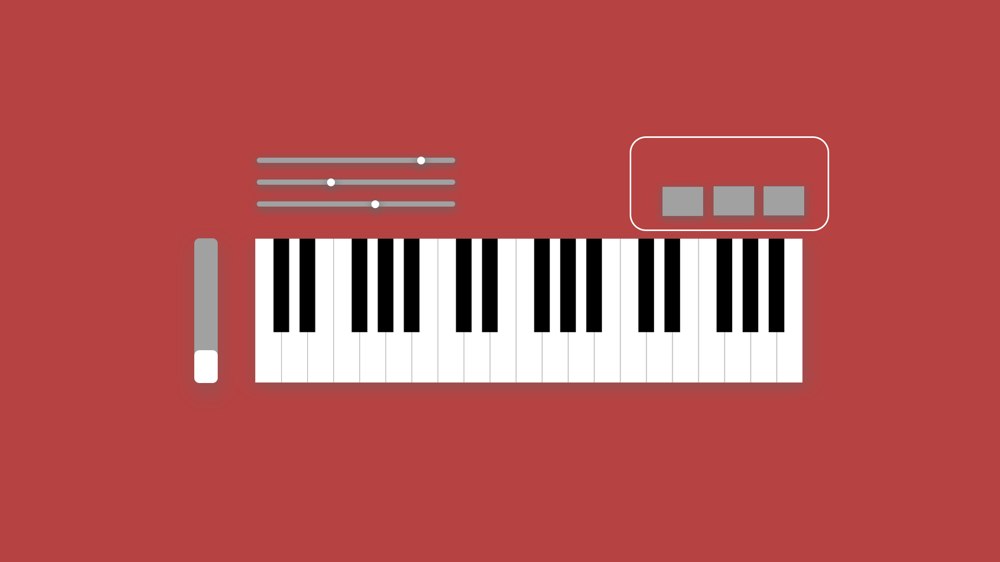
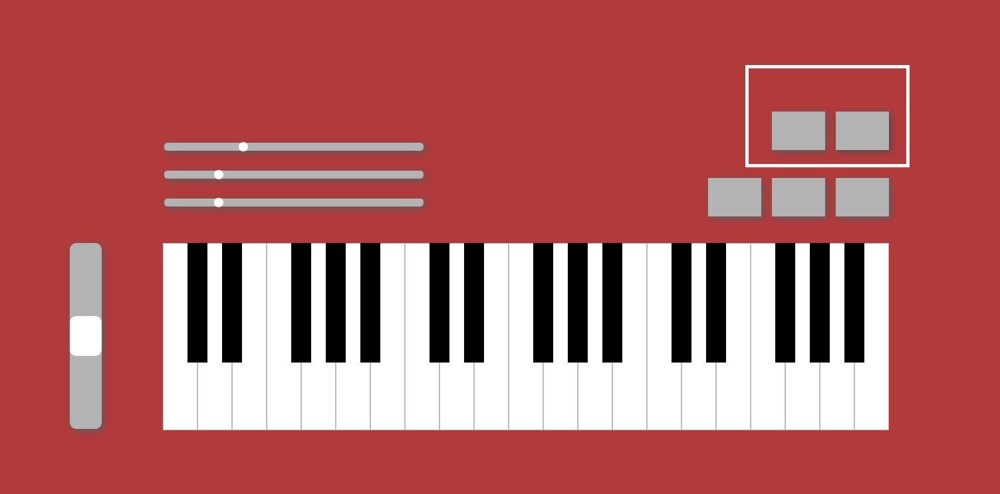

# Instructions

## Note Play

### 

### Mouse Click

You can use the mouse to click the keyboard to play. You can hold the mouse to play the whole note sound based on the preset ADSR sound envelop.

### Touch

You can use finger touch to trigger the note on the touch screen devices. You can keep the finger touch to play the whole note sound based on the preset ADSR sound envelop.

### Keyboard

You can use the below keys on your keyboard to play the corresponding notes. You can keep the key down to play the whole note sound based on the preset ADSR sound envelop.

> Only supporting the lowest part of the scales

```js
  z: "C",
  s: "C#",
  x: "D",
  d: "D#",
  c: "E",
  v: "F",
  g: "F#",
  b: "G",
  h: "G#",
  n: "A",
  j: "A#",
  m: "B",
```

## Octave Control


+ This simple-keyboard supports from C1 to B7 notes.

+ The default scale range is from C3 to B5. You can use the sidebar or use `[` and `]` key on the keyboard to change the used octaves.

+ Press `[` or slide up to increase one octave.
+ Press `]` or slide down to decrease one octave.

## Volume, Release Time, Sustain Time control



### Volume Control

Use the bottom slider to control the volume. The default volume is -6 dB. The control range is from -10 dB to 10 dB. Slide left to decrease the volume, slide right to increase the volume.

### Release Time

Use the middle slider to control the release time of one note. The default release time is 1s. The control range is from 0 to 5s. Slide left to decrease the release time, slide right to increase the release time.

### Sustain Time

Use the top slider to control the sustain time of one note. The default sustain time is 0.3s. The control range is from 0 to 1s. Slide left to decrease the sustain time, slide right to increase the sustain time.

## Sustain Button, AutoWah Effect, Distortion Effect



### Sustain Button

When you click the left button, you turn on the sustain mode of the note. This will allow you to sustain the note and ignore the set sustain time. The note will only release when you release the key down, finger touch, or mouse click. 

### AutoWah Effect

When you click the middle button, you turn on the auto-wah effect of the note. 

### Distortion Effect 

When you click the right button, you turn on the distortion effect of the note. 

> Note: You can turn all the effects at the same time. Click the button again to turn off the effect.

## Record and Play



### Record

Click the left button to turn on the recorder. Then all the notes you play will be recorded.

Click the button again to end the recording. After that, a new button will generate at the left of the record button. When you click that button, you can download your recording in the .webm extension.

### Play

After recording, you can click the right button to play the recording.

> Note: Not support mobile devices.